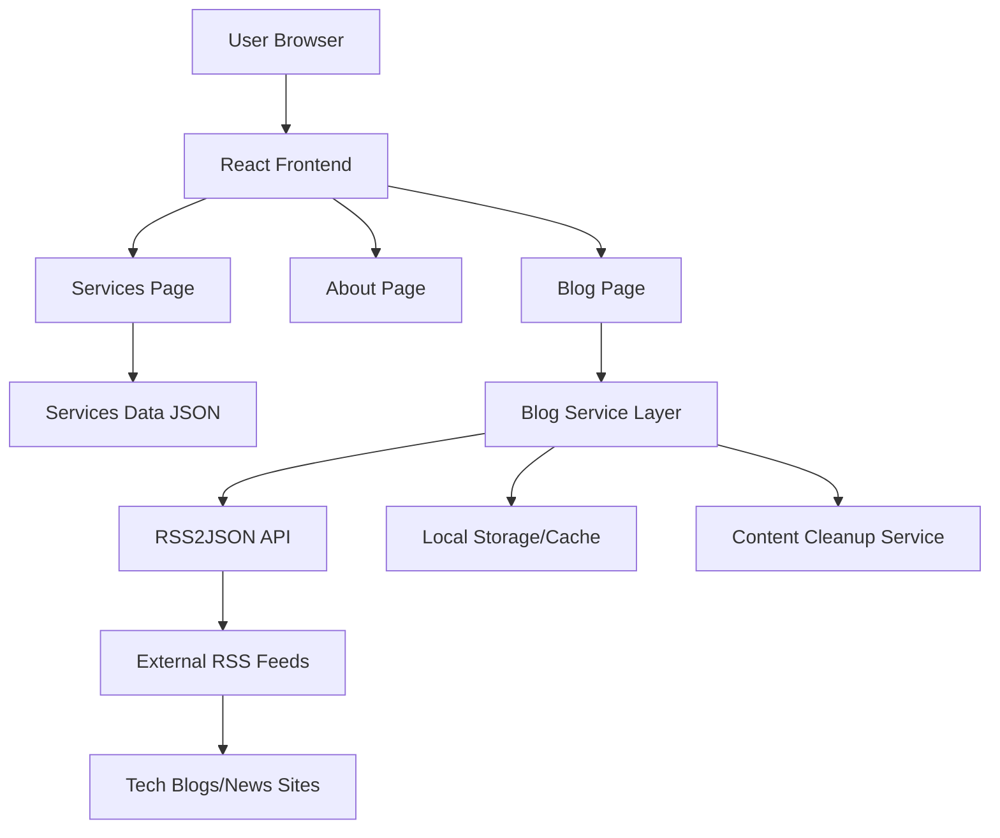

# Design Document

## Overview

This design outlines the implementation of three core pages for the Techlis website: Services, About, and Blog pages. The Services page will showcase detailed service offerings using existing data, the About page will present company information and team details, and the Blog page will implement an automated content aggregation system using RSS feeds and external APIs to display trending technology content.

The design emphasizes modern web development practices, responsive design using shadcn/ui components, and automated content management for the blog system.

## Architecture

### High-Level Architecture



### Technology Stack

- **Frontend Framework**: React with TypeScript
- **UI Components**: shadcn/ui for consistent design
- **Styling**: Tailwind CSS
- **Data Fetching**: Native fetch API with error handling
- **Content Management**: RSS2JSON API for blog aggregation
- **Storage**: Local storage for caching and content management
- **Build Tool**: Vite

## Components and Interfaces

### Services Page Components

#### ServiceCard Component

```typescript
interface Service {
  id: string
  title: string
  icon: string
  description: string
  features: string[]
  technologies: string[]
  pricing: string
}

interface ServiceCardProps {
  service: Service
  className?: string
}
```

#### ServicesGrid Component

```typescript
interface ServicesGridProps {
  services: Service[]
}
```

#### ServicesCTA Component

```typescript
interface ServicesCTAProps {
  title: string
  description: string
  buttonText: string
  onButtonClick: () => void
}
```

### About Page Components

#### CompanyInfo Component

```typescript
interface CompanyInfoProps {
  mission: string
  vision: string
  values: string[]
}
```

#### FounderProfile Component

```typescript
interface Founder {
  name: string
  title: string
  bio: string
  image?: string
}

interface FounderProfileProps {
  founder: Founder
}
```

#### TeamStructure Component

```typescript
interface TeamInfo {
  onshoreTeam: {
    size: number
    description: string
    expertise: string[]
  }
  offshoreTeam: {
    size: number
    description: string
    expertise: string[]
  }
}

interface TeamStructureProps {
  teamInfo: TeamInfo
}
```

### Blog Page Components

#### BlogPost Interface

```typescript
interface BlogPost {
  id: string
  title: string
  description: string
  link: string
  pubDate: string
  source: string
  category: "ai-ml" | "software-dev" | "web-mobile" | "cloud-devops"
  isArchived: boolean
  createdAt: string
}
```

#### BlogService Class

```typescript
class BlogService {
  private readonly RSS_FEEDS: RSSFeed[]
  private readonly API_KEY: string
  private readonly CACHE_DURATION: number

  async fetchLatestPosts(): Promise<BlogPost[]>
  async archiveOldPosts(): Promise<void>
  async deleteExpiredPosts(): Promise<void>
  private filterRelevantPosts(posts: any[]): BlogPost[]
  private categorizePost(post: any): string
}
```

#### BlogPostCard Component

```typescript
interface BlogPostCardProps {
  post: BlogPost
  onReadMore: (post: BlogPost) => void
}
```

#### BlogFilters Component

```typescript
interface BlogFiltersProps {
  categories: string[]
  selectedCategory: string
  onCategoryChange: (category: string) => void
}
```

## Data Models

### RSS Feed Configuration

```typescript
interface RSSFeed {
  url: string
  name: string
  category: "ai-ml" | "software-dev" | "web-mobile" | "cloud-devops"
  priority: number // 1-5, higher is more important
}

const RSS_FEEDS: RSSFeed[] = [
  {
    url: "https://feeds.feedburner.com/oreilly/radar",
    name: "O'Reilly Radar",
    category: "software-dev",
    priority: 5,
  },
  {
    url: "https://machinelearningmastery.com/feed/",
    name: "Machine Learning Mastery",
    category: "ai-ml",
    priority: 4,
  },
  {
    url: "https://aws.amazon.com/blogs/aws/feed/",
    name: "AWS Blog",
    category: "cloud-devops",
    priority: 5,
  },
  {
    url: "https://blog.google/technology/developers/rss/",
    name: "Google Developers Blog",
    category: "web-mobile",
    priority: 4,
  },
]
```

### Content Storage Schema

```typescript
interface StoredBlogData {
  posts: BlogPost[]
  lastFetch: string
  categories: Record<string, number> // category -> post count
}
```

### Company Data Model

```typescript
interface CompanyData {
  name: string
  mission: string
  vision: string
  values: string[]
  founder: Founder
  team: TeamInfo
  established: string
  locations: string[]
}
```

## Error Handling

### Blog Service Error Handling

```typescript
class BlogError extends Error {
  constructor(
    message: string,
    public code: "FETCH_ERROR" | "PARSE_ERROR" | "RATE_LIMIT" | "NETWORK_ERROR",
    public source?: string
  ) {
    super(message)
  }
}

interface ErrorBoundaryState {
  hasError: boolean
  error?: BlogError
  fallbackContent?: BlogPost[]
}
```

### Fallback Strategies

1. **Network Failures**: Display cached content with timestamp
2. **API Rate Limits**: Implement exponential backoff and show cached data
3. **Parse Errors**: Log error and skip problematic feeds
4. **Empty Results**: Show placeholder content with retry option

## Testing Strategy

### Unit Testing

- **Services Page**: Test service card rendering, data display, responsive layout
- **About Page**: Test company information display, team structure rendering
- **Blog Service**: Test RSS parsing, content filtering, caching logic
- **Blog Components**: Test post display, filtering, pagination

### Integration Testing

- **RSS2JSON API Integration**: Test API calls, error handling, data transformation
- **Content Cleanup**: Test archiving and deletion logic
- **Cache Management**: Test storage and retrieval of blog data

### End-to-End Testing

- **Page Navigation**: Test routing between all pages
- **Content Loading**: Test initial page loads and data fetching
- **Responsive Design**: Test layout on different screen sizes
- **Blog Functionality**: Test filtering, pagination, and content updates

### Performance Testing

- **Page Load Times**: Ensure sub-3-second loading
- **API Response Times**: Monitor RSS2JSON API performance
- **Cache Efficiency**: Test cache hit rates and storage usage

## Implementation Details

### RSS2JSON API Integration

```typescript
const RSS2JSON_CONFIG = {
  baseUrl: "https://api.rss2json.com/v1/api.json",
  apiKey: process.env.VITE_RSS2JSON_API_KEY,
  maxCount: 10,
  timeout: 5000,
}

async function fetchRSSFeed(feedUrl: string): Promise<any> {
  const params = new URLSearchParams({
    rss_url: feedUrl,
    api_key: RSS2JSON_CONFIG.apiKey,
    count: RSS2JSON_CONFIG.maxCount.toString(),
  })

  const response = await fetch(`${RSS2JSON_CONFIG.baseUrl}?${params}`, {
    signal: AbortSignal.timeout(RSS2JSON_CONFIG.timeout),
  })

  if (!response.ok) {
    throw new BlogError("Failed to fetch RSS feed", "FETCH_ERROR", feedUrl)
  }

  return response.json()
}
```

### Content Filtering Logic

```typescript
function isRelevantPost(post: any): boolean {
  const keywords = {
    "ai-ml": [
      "artificial intelligence",
      "machine learning",
      "deep learning",
      "neural network",
      "AI",
      "ML",
    ],
    "software-dev": [
      "programming",
      "development",
      "coding",
      "software",
      "framework",
      "library",
    ],
    "web-mobile": [
      "web development",
      "mobile app",
      "react",
      "javascript",
      "frontend",
      "backend",
    ],
    "cloud-devops": [
      "cloud",
      "devops",
      "kubernetes",
      "docker",
      "aws",
      "azure",
      "deployment",
    ],
  }

  const content = `${post.title} ${post.description}`.toLowerCase()

  return Object.values(keywords).some((categoryKeywords) =>
    categoryKeywords.some((keyword) => content.includes(keyword.toLowerCase()))
  )
}
```

### Automated Cleanup System

```typescript
class ContentCleanupService {
  private readonly THREE_WEEKS_MS = 21 * 24 * 60 * 60 * 1000
  private readonly FIVE_MONTHS_MS = 5 * 30 * 24 * 60 * 60 * 1000

  async performCleanup(): Promise<void> {
    const now = Date.now()
    const storedData = this.getStoredData()

    // Archive posts older than 3 weeks
    const postsToArchive = storedData.posts.filter((post) => {
      const postAge = now - new Date(post.pubDate).getTime()
      return postAge > this.THREE_WEEKS_MS && !post.isArchived
    })

    // Delete posts older than 5 months
    const postsToKeep = storedData.posts.filter((post) => {
      const postAge = now - new Date(post.pubDate).getTime()
      return postAge <= this.FIVE_MONTHS_MS
    })

    // Update archived status
    postsToArchive.forEach((post) => (post.isArchived = true))

    // Save updated data
    this.saveStoredData({
      ...storedData,
      posts: postsToKeep,
    })
  }
}
```

### Responsive Design Implementation

- **Mobile-first approach** using Tailwind CSS breakpoints
- **Grid layouts** that adapt from 1 column (mobile) to 3 columns (desktop)
- **Typography scaling** using responsive text classes
- **Touch-friendly interactions** with appropriate button sizes
- **Image optimization** with responsive loading and fallbacks

### SEO and Accessibility

- **Semantic HTML** structure with proper heading hierarchy
- **Alt text** for all images and icons
- **ARIA labels** for interactive elements
- **Meta tags** for each page with relevant descriptions
- **Structured data** for blog posts and company information
- **Keyboard navigation** support for all interactive elements
